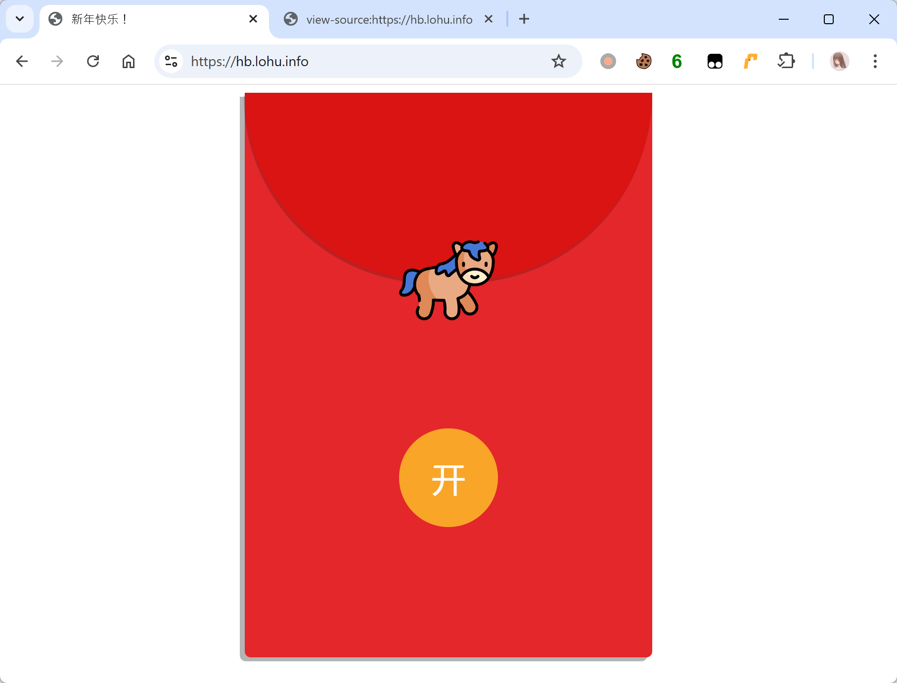
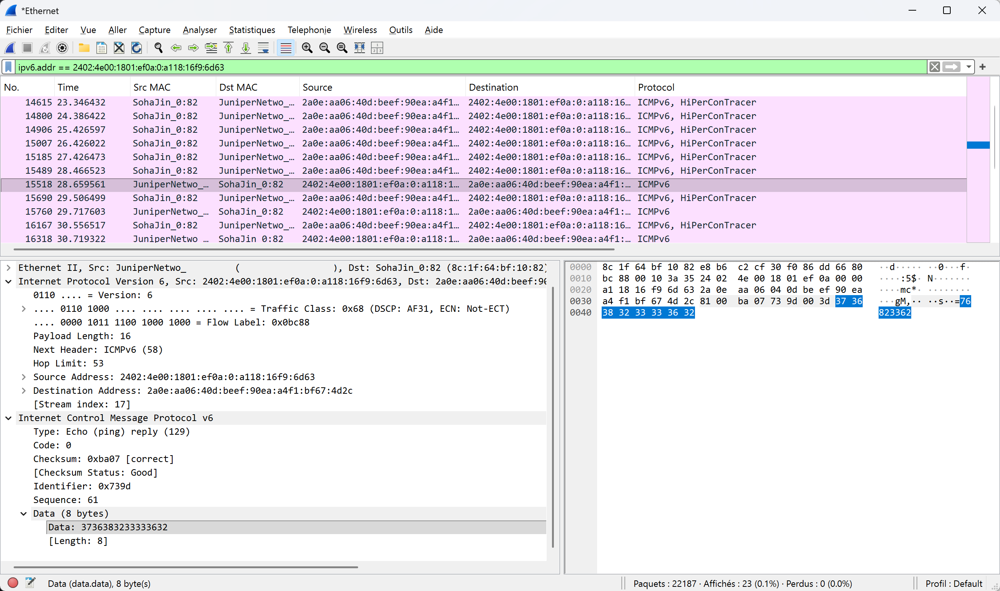
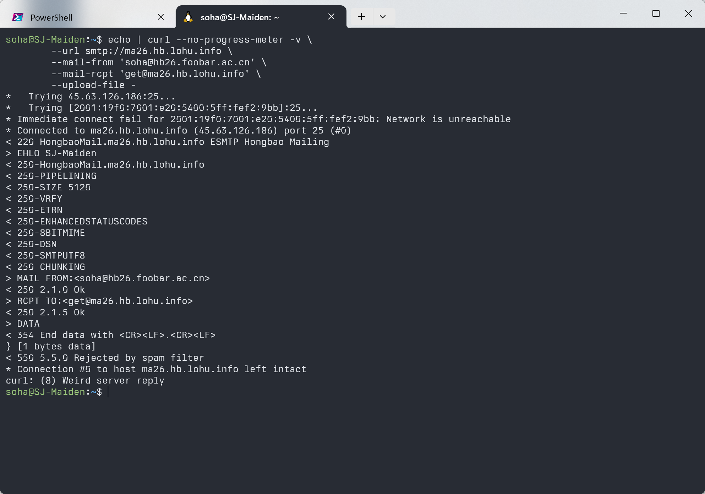
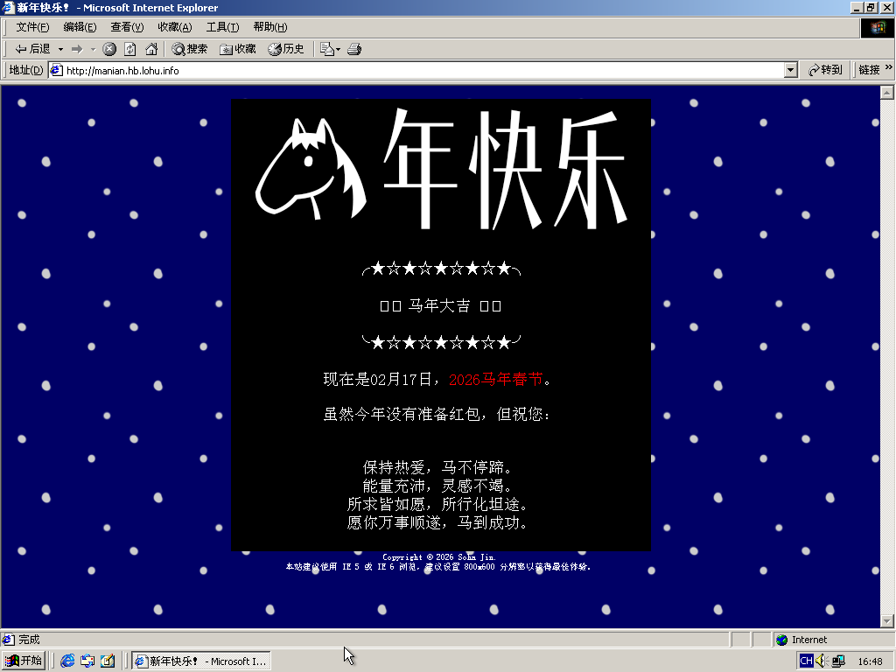
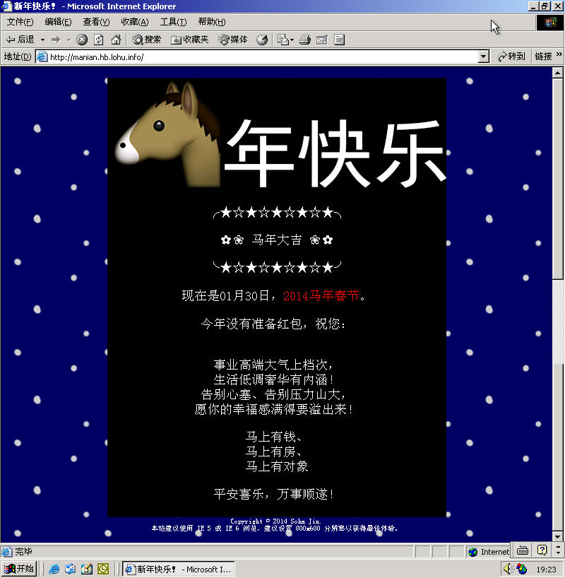
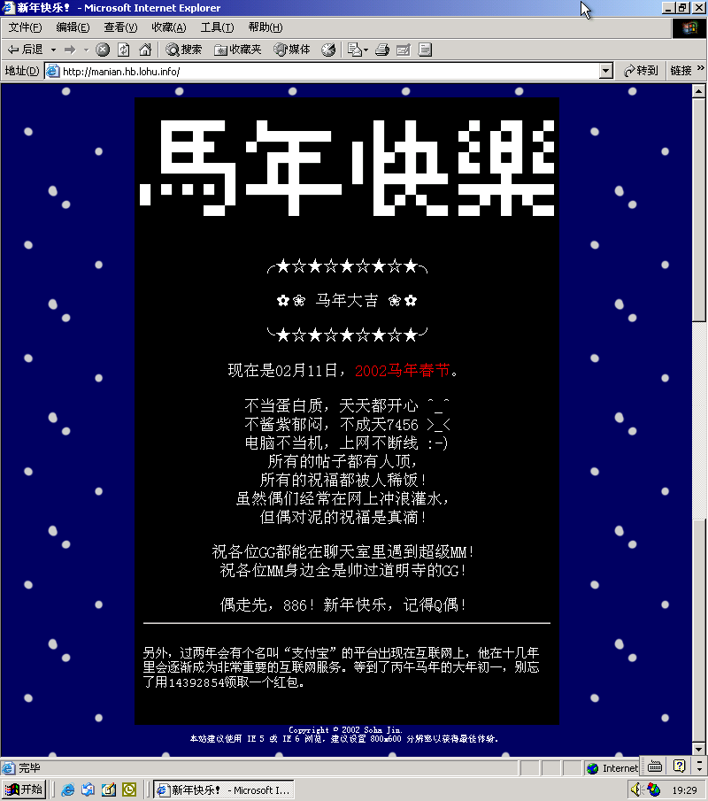

2015 年支付宝推出了口令红包，那两年也是群友最热衷于制作解谜红包的时候，一个春节在一个群里就可以有好几道题目可以做。大家把 8 位口令按照自己的创意藏在各种地方。在做了各种群友的红包以后，我觉得这个活动形式非常有意思，于是 2016 年我第一次参与了出题，并从 2018 年持续至今。红包口令一直是 8 位数也是从那时候传下来的。

因此，今年出题的想法是返璞归真，回到十年前简单 misc 的乐趣。3 个题目也都是前几个月一个个在脑子里蹦出来，记录下来而产生的。

不得不说，2025 年是 AI agent 发展非常迅速的一年，从日志可以看出很多参与者都“雇佣”了 agent 帮他们干活。虽然我还在坚持“古法编程”，但也经常指使 AI 帮我查资料。提到这个则是因为见到了 AI agent 对红包题目的降维打击，确实没想到最后看日志会发现数名硅基生物的痕迹。向使用了 AI 解题的群友要了思考过程，注意到 AI 虽然也和人类一样，尝试的过程比较随机、会绕弯路，但靠其并发能力和广阔的脑洞，最终可以解出今年的 3 个红包。但是，作为出题人而言，从活动的本意出发，我可以接受把 AI 当作群友一同讨论，但无法接受让 AI 完全自己完成。这不光是对出题人的尊重，也是对其他徒手参与者的尊重。

接下来我们来做一下这些题目。打开页面，还是祖传的页面。有些朋友可能会注意到 `.redbag` 里面的 `transition-duration: 1082.8359ms;`，但如果看过去年的题解应该会知道这里是我忘了改（不好意思，嘻嘻），而不是一个红包。



点击“开”之后，可以看到两个域名，一个有链接，一个没链接。查看源代码还可以发现一个注释掉的域名。接下来我将一个个解答。

```html
<p>→ <code>26horse.hb.lohu.info</code></p>
<p>→ <a href="https://manian.hb.lohu.info"><code>manian.hb.lohu.info</code></a></p>
<!--p>→ <code>ma26.hb.lohu.info</code></p-->
```

## 遅延好き

首先查询 DNS 记录，发现 `26horse.hb.lohu.info` 只有一个 AAAA 的记录，并且这个 IP 什么端口都没开。如果 ping 的话，好像也没……诶，有响应！

<!--video autoplay loop muted src="./part1-deferred.mp4" alt="the deferred echo replies"></video-->


Linux 的 ping 工具会明确提示“`(truncated)`”，那这回包明显是有点东西了。至于为什么要 8、9 秒才会收到，单纯只是我想延迟了，所以把每个返回报文都缓存了一个固定的时间才返回，有些朋友如果不够耐心就会错过回包。

打开 Wireshark 观察 ICMP echo reply 就可以发现红包口令被直接写在回包的 payload 里面。



这个题目设计上是签到题，但是 52 元分 68 个的红包只被领走 41/68 个（共 32.51 元），一血在 T+00:13:20。

## 发个红邮包

`ma26.hb.lohu.info` 虽然没有给链接，但是如果直接访问的话也可以注意到其上有一个 HTTP 服务，有着和 landing 页面一样的内容，只是点击红包“开”以后的内容不一样：

> 请 foobar 院新年红包研究所的同志使用自己的 `@hb26.foobar.ac.cn` 邮箱编撰一封邮件，发送到 `get@ma26.hb.lohu.info` 领取。

怎么直接把获取方式写了出来，这道题未免也太简单了吧！让我们来试试：

```shell
echo | curl --no-progress-meter -v \
	--url smtp://ma26.hb.lohu.info \
	--mail-from 'soha@hb26.foobar.ac.cn' \
	--mail-rcpt 'get@ma26.hb.lohu.info' \
	--upload-file -
```



可恶，果然没有这么简单！系统返回了“`550 5.5.0 Rejected by spam filter`”！而如果我们尝试修改收件人、发件人等信息，也只会获得 `550 5.1.1 This mailbox is not found.`、`550 5.7.1 Sender domain is not in the whitelist.` 等报错。

即使你写出了如下漂亮美丽的邮件正文：

```email
Date: Tue, 17 Feb 2026 14:07:29 +0800
From: "hongbao" <hongbao@hb26.foobar.ac.cn>
To: <get@ma26.hb.lohu.info>
Subject: New Year Red Packet
Content-Type: text/plain; charset="utf-8"

foobar 院新年红包研究所的同志们新年快乐！
我是来自 foobar 院的 Soha，申请领取新年红包。

Best regards,
Soha
```

也逃不过 `Rejected by spam filter` 的命运。

<del>本来以为大家会整点活的，结果翻了半天都没见到什么有意思的邮件。</del>

那么该怎么办呢？让我们回忆一下电子邮件反垃圾的最基本规则：首先要确定发信人是获得授权的，对应到现实中的方式就是 SPF 和 DKIM。前者在 DNS 中定义了哪些主机可以以某域名的名义发邮件，后者则是在 DNS 中公开了公钥，使用密码学手段对邮件进行签名。

查询 SPF 记录可得：

```
$ dig +short TXT hb26.foobar.ac.cn
"v=spf1 ip6:2a0e:aa06:40d:beef::/64 ip6:2a09:bac0::/29 ip6:2a0e:aa06:40e:beef::/64 ip6:2606:54c0::/30 -all"
```

某群友说：“我随手查了两个前缀发现都在 Soha 网内，我以为关键点不在这儿呢。”但他只要再查一个就可以发现 IP 是来自 Cloudflare 的了：

```
$ whois 2a09:bac0::

inet6num:       2a09:bac0::/32
netname:        CLOUDFLAREWARP
country:        US
admin-c:        CAC80-RIPE
tech-c:         CTC6-RIPE
status:         ALLOCATED-BY-LIR
mnt-by:         MNT-CLOUDFLARE
created:        2019-03-14T22:39:38Z
last-modified:  2019-03-19T21:12:40Z
source:         RIPE # Filtered
```

Cloudflare 被称为“互联网大善人”，其中的一个原因就是提供了免费的 VPN 服务“WARP”，保护用户的原始 IP 不被自己的 ISP 追踪~~，转而把自己的底裤卖给 Cloudflare~~。所以看起来，我们利用 WARP 就可以获得 `hb26.foobar.ac.cn` 授权发信的 IP 了。

配置好 WARP，然后访问！诶？这回怎么连服务器都连不上了。原来是 Cloudflare 封掉了出向的 25 端口，这也是 ISP 非常常见的为了避免自己的 IP 被发垃圾邮件而“弄脏”的安全策略。

在这里，为了避免这种情况，我开了 587 端口和 2525 端口供大家使用，前者是 RFC 6409 中指定的用于 Mail Submission（也就是给用户发往自己的邮件服务提供商用的）的端口，后者则是非标准的 25 端口替代（也是 Mail Submission 用途）。虽然他们都不是正规的发邮件给对方 MTA 的端口，但是毕竟作为红包不需要这么严谨嘛。


这样，就能得到红包口令了：

```
550-5.2.2 Happy New Horse Year!
550 5.2.2 Hongbao: 82460732
```

注意：我只设置了 IPv6 的前缀，如果不强制使用 IPv6 的话，可能会使用 IPv4 连接服务器，这依旧是会失败的。

在现实当中，收件方在发件方给出 MAIL FROM 的时候通常就已经进行了 SPF 检查，不会像我一样等到整个邮件都收完的时候才拒绝（[源码](https://github.com/moesoha/red-packet-2026/blob/master/part2/src/main.rs#L94)）。但实在想看看网友们的创造力，会不会搞出什么有趣的邮件内容，所以在 Milter 发送 EOM 事件的时候才统一检查。 当然，如果在 MAIL FROM 的时候就检查，很多朋友应该也能够更快地发现答案了。

这个红包 68 元分 28 个，被全部领完，一血发生在 T+00:15:33。这个题目应该是今年最有趣的一道，但是他的思考链条比较清晰、直接，所以如果使用 AI 在福至心灵的情况下，能够一发入魂。或许这就是这个红包在 T+10:53:37 的时候能够被全部领完的原因吧。

## 中古祝福

这个红包直接给了一个链接 `https://manian.hb.lohu.info`，点开以后可以看到一个 20 年前风格的页面。底部还说“本站建议使用 IE 5 或 IE 6 浏览，建议设置 800x600 分辨率以获得最佳体验。”真是非常 20 年前的设定呢。我们用 IE 5 打开，发现并没有什么变化，只是有两个图案因为字符集问题不能显示出来（哈哈，我欠考虑了，IE 6 是能正常显示的）。



既然和 IE 5 没关系，那么该从哪里入手呢？作为一个祝福页面，还显示了今天的日期，是不是有点奇怪了？而且在 HTML 里，显示日期的那行还有页面中唯一的一个 ID：`date`。其实这里就是为了暗示我们要操纵时间。开始后 3 小时我[加了一句](https://github.com/moesoha/red-packet-2026/commit/39b57369a6e58f3ce7c662d288dcc165736d14bb)“虽然今年没有准备红包”，也是为了暗示这一点：既然今年没有，那去年或者明年会有吗。

那么怎么做才能操控时间呢？

在 HTTP 规范 [RFC 9110](https://datatracker.ietf.org/doc/html/rfc9110#section-6.6.1) 中，有个名为 `Date` 的 header，用来表示消息产生的日期和时间。一些朋友以为这个是只有服务端才能发送的，其实不然，规范里是这样写的：

> A user agent **MAY** send a Date header field in a request, though generally will not do so unless it is believed to convey useful information to the server. For example, custom applications of HTTP might convey a Date if the server is expected to adjust its interpretation of the user's request based on differences between the user agent and server clocks.
> 
> 用户代理（User Agent）**可以**在请求中发送 Date header，但通常不会这样做，除非认为他能传递有用的信息给服务器。例如，一些定制的 HTTP 应用中，可能会传递 Date header 以期服务器能根据用户代理与服务器时钟之间的差异来调整其对用户请求的解析。

请求方发送 Date 在现实中的例子往往出现在各类 API 的操作中，例如在对请求签名时加上 Date 的值，服务器就可以判断请求是否过期。

那么接下来，我们就能使用自己喜欢的工具，尝试为请求增加 Date 了，例如：

```shell
curl -H 'Date: Fri, 05 Feb 2027 04:00:00 GMT' https://manian.hb.lohu.info/
```


页面里面给出了：“现在是 2027 年 02 月 05 日，不在马年春节活动时间哦。”说明基于 Date 的时间操控有效，而且关键是活动只限于马年春节。那么再试试 2014 年的甲午马年吧，我们用 `Thu, 30 Jan 2014 04:00:00 GMT` 就可以获得：



还是没有红包，那么再试试壬午马年 `Mon, 11 Feb 2002 04:00:00 GMT`，搞定！



注意哦，IE 5 或 IE 6 并不是白写的，一些朋友发现了 Date 的秘密，但忘了把这两个要素组合在一起。毕竟 Chrome 在 2002 年可不存在呀。

翻看日志，很多请求都是在暴力枚举目录里面可能的东西。有一位来自韶关的硅基生物，想了 114514 种 query 的 fuzz 方法，几乎把所有能用的东西都塞进 query 跑了一遍。有群友表示我的题目给的提示实在是太少了，做这道题目确实需要开一点脑洞，但我觉得新加的一句话和原有的 date 提示也已经够了。也许把时间显示加上具体的小时、分钟，会不会更容易让人想到呢？

这个红包 68 元分 36 个，领走 23/36 个（共 42.51 元），一血发生在 T+03:54:28。

## 硅基生物魅力时刻

这次实在有太多网友压榨他们的硅基苦工找红包，因此在这里列一下和 AI 有关的内容。

有一位来自嘉兴的硅基生物，在尝试“中古祝福”的时候。正确设置了 `Date` 和 `User-Agent` 以后拿到了口令，但他不觉得那是口令，继续把这个填到 cookies 里、填到 UA 里、填到 query 里、填到图片地址里面尝试找到红包，最后在 T+21h 的时候放弃。

有一位来自伦敦的碳基生物，在和他的硅基生物（非 agent，只是 chat）聊天共同分析“中古祝福”的时候，硅基生物建议过设置 `Date`，但这位碳同志认为他是在胡说八道。而在研究“发个红邮包”的时候，硅基生物建议过使用 SPF 记录中的 IP 地址，但这位碳同志认为地址都是我的，让硅同志想想别的办法。

在“中古祝福”中，有一位来自马鞍山的硅基生物和一位来自邵阳的硅基生物凭一己之力占据了活动期间请求的 78%。他们俩都对着目录枚举了单词表。硅基生物聪不聪明不重要，但是他们是真的有毅力和耐心啊。例如邵阳的硅同志一直在 fuzz path 和 query 等参数的路上渐行渐远，而这些都是无意义的尝试。

马鞍山的硅同志在尝试“中古祝福”期间都记得要带着 IE 的 UA。他在枚举完单词表后两分钟，终于发现了可能需要写 Date header。他用 curl 测试了 2018、2027、2025 年的日期以后，终于发现了端倪，写了一个 Python 脚本，多线程地逐分钟枚举 2026 年的日期。后来可能硅同志发现不对，改成了从 1970 年开始逐日枚举，直到 2099 年。但因为没有设置 UA（不然我也不知道是 Python 了），所以最后也没拿到红包。我又跟着他的特征查询了邮件记录，发现他在“发个红邮包”的尝试过程中想到了使用 WARP，但看起来并没有强制使用 IPv6，结果一直在用 WARP 的 IPv4 地址撞墙。

在“发个红邮包”里面，有几名硅基生物通过调整正文措辞、尝试各种 header 的排列组合来尝试绕过“反垃圾邮件系统”。邮件数量最多的也是那位上面提到的来自邵阳的硅基生物，占据了系统一半的收件量。不过功夫不负有心硅，他在尝试了大概 1010 封的时候，终于意识到得用 WARP 通过 SPF 检查。很不幸的是，他在绕过后继续使用 fuzz 手段发了 95 封邮件，也不知道最后有没有注意到系统早在第一封就已经把红包口令返回了。